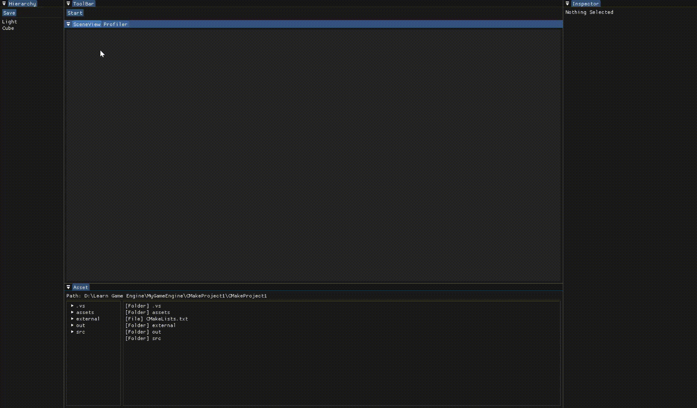

# MyGameEngine

A C++ OpenGL game engine and editor prototype focused on scene editing, component-based game objects, asset references, serialization, and real-time rendering tools.


## Overview

MyGameEngine is a personal engine/editor project built to explore the core systems behind real-time game tools. The project includes a custom editor UI, a GameObject/component architecture, scene serialization, asset references, and an OpenGL rendering path using GLFW, Dear ImGui, glad, and GLM.

The goal of this project is to build practical engine architecture from the ground up while keeping the editor usable enough for testing scenes, assets, materials, and rendering behavior.

## Features

- Dockable editor interface with Scene, Hierarchy, Inspector, Asset, Toolbar, and Profiler views
- GameObject and Component system with Transform and rendering-related components
- Inspector editing for object data, component data, reference fields, materials, and light properties
- Scene serialization and loading through JSON-based engine object data
- Asset management with material, shader, vertex data, and reference resolution support
- OpenGL rendering pipeline with shader and material assets
- CMake-based project setup with vendored third-party dependencies

## Editor Preview

### Runtime and Editor Interaction



### Light and Material Editing


### Asset Reference Field


## Tech Stack

- C++20
- CMake
- OpenGL
- GLFW
- Dear ImGui
- glad
- GLM

## Build and Run

### Requirements

- Windows 10/11
- Visual Studio 2022
- CMake
- A C++20-compatible compiler

### Steps

1. Clone the repository.
2. Open the `CMakeProject1` folder in Visual Studio 2022.
3. Select an x64 debug preset.
4. Build and run the `CMakeProject1` target.

Third-party dependencies are included under `CMakeProject1/CMakeProject1/external`, so no separate dependency download is required for the current setup.

## Project Structure

```text
CMakeProject1/
  CMakeLists.txt
  CMakePresets.json
  CMakeProject1/
    assets/       Sample scenes, shaders, materials, and vertex assets
    external/     Vendored third-party dependencies
    src/          Engine, editor, rendering, asset, and serialization code
doc/              Screenshots and demo GIFs
```

## Source Layout

- `src/Engine` - scene, GameObject, component, and engine update systems
- `src/Editor` - editor application, dockable views, inspector UI, toolbar, and commands
- `src/Assets` - asset manager, materials, reference descriptions, and reference resolving
- `src/Serialization` - reflection, class/component registry, engine object handles, and scene serialization
- `src/rendering` - OpenGL rendering, shaders, lighting, GPU data, and vertex data management

## Current Focus

This project is still in active development. Current areas of focus include improving editor workflows, expanding asset tooling, strengthening serialization, and making the rendering/component systems easier to extend.
